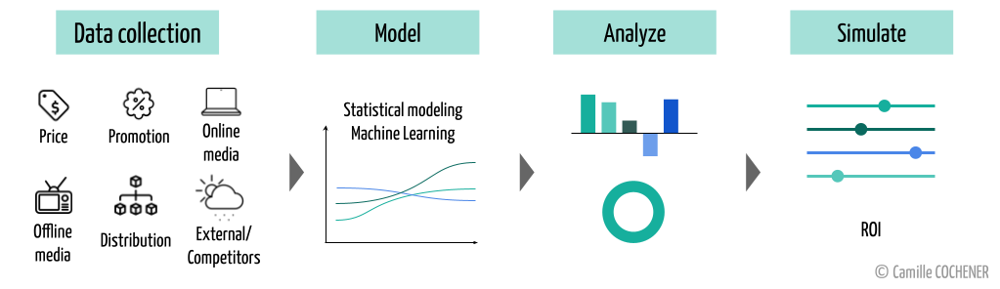

[Professional experience](./professional-experience.html) | Projects | [Blog articles](./blog-articles.html) | [Contact](mailto:cochenercamille@yahoo.fr)

## Project Portfolio

Hackathon Ecole Polytechnique/Carrefour (Rank: 1st) - Marketing Mix Modeling

 <i>From February 2020 to April 2020 - 2 months</i> 

<u>Objective</u> : to build a local Marketing Mix Modeling (MMM) in order to analyze and predict the impact of marketing media on sales (ROI)

I took part in the annual hackathon organized by the "Next Gen RetAIl" chair at <a href="https://www.polytechnique.edu/">Ecole Polytechnique</a>, which gathered 132 students in 26 teams. During this challenge, <a href="https://www.carrefour.fr/">Carrefour</a>, the sponsor of the chair, proposed 3 study themes: building the optimal product DNA of a shop, designing a Local MMM and optimizing the frequency and packaging of in-store supplies.  

My team won the hackathon by proposing a MMM with a local granularity that focuses specifically on organic products. Our model allows to determine the business drivers of organic product sales. 
 

What is a MMM ?

Marketing Mix Modeling studies the relationships between marketing spending and business performance (i.e. revenue, sales) to determine business drivers and estimate return on investment (ROI). It helps marketing experts to better allocate their budgets on marketing channels. 
 

To build our model, we had access to more than 30 historical datasets on all products, purchases, marketing investments and sales of Carrefour shops. Using these, we were able to train a very efficient Machine Learning algorithm, <a href="https://catboost.ai/">CatBoost</a>, and then interpret it using <a href="https://shap.readthedocs.io/en/latest/">Shapley values</a>. The results were presented in the form of a user-friendly dashboard built with <a href="https://plotly.com/dash/">Dash</a>.

The hackathon ended with a pitch session during which we provided recommendations that were in line with the <a  href="https://www.carrefour.com/fr/groupe/transition-alimentaire">food transition objectives</a> of the company to a jury of Carrefour directors.

<a href="https://github.com/camillecochener/Hackathon-X-Carrefour-2020" rel="nofollow noopener noreferrer"> <i class="fab fa-github" style="padding: 5px"></i>Details on Github</a> <a href="https://www.polytechnique.edu/en/content/hackathon-chair-next-gen-retail-comes-end" rel="nofollow noopener noreferrer"><i class="far fa-newspaper" style="padding: 5px"></i>Article - Polytechnique</a> <a href="https://www.telecom-paris.fr/telecom-paris-remporte-hackathon-x-carrefour-ai-data-science" rel="nofollow noopener noreferrer"><i class="far fa-newspaper" style="padding: 5px"></i>Article - Télécom Paris</a>

Toxic Comment Classification Challenge - NLP

 <i>From March 2020 to June 2020 - 3 months</i> 

<u>Objective</u> : to build a multi-headed model that’s capable of detecting different types of toxicity like threats, obscenity, insults, and identity-based hate better than Perspective’s current models. 

The <a href="https://www.perspectiveapi.com/">Perspective API</a> uses Machine Learning to identify abusive comments. It is the product of a collaborative research effort operated by <a href="https://jigsaw.google.com">Jigsaw</a> and Google’s Counter Abuse Technology team, named <a href="https://conversationai.github.io/">Conversation AI</a>. They made their data available as part of a <a href="https://www.kaggle.com/c/jigsaw-toxic-comment-classification-challenge/overview">Kaggle challenge</a> (2018) to enhance research about this topic and improve the tools to combat online toxicity and harassment.
 

In this competition, we have to build a multi-label model to detect the toxicity of a sentence using a dataset of about 160k comments from Wikipedia’s talk page edits.
 

What is a multi-label classification model ?

Multi-label classification is a variant of classification problem where multiple labels could be assigned to each instance. On the contrary, a multiclass classification is a single-label problem in which instances are categorized into precisely one class. 

In our study, several deep learning approaches were tested and compared : Logistic regression (LR), Long Short-Term Memory Networks (LSTM), Convolutional Networks (CNN) combined with language processing techniques (NLP) and word representation methods (Word Embedding). Our final selected model was a bi-directional LSTM neural network. The results of this model were excellent: the AUC score obtained was 98%.

<i>Note : As we participated in this competition as a "late submission", we couldn't obtain a ranking.</i>

To go further, we've built a user-friendly application using <a href="https://plotly.com/dash/">Dash</a> to serve our model which could be deployed on <a href="https://www.heroku.com/">Heroku</a> for example. 

<a href="https://github.com/camillecochener/Toxic-comment-classification-challenge" rel="nofollow noopener noreferrer"> <i class="fab fa-github" style="padding: 5px"></i>Details on Github</a>

Hackathon QMI/LFIS/Dauphine (Rank: 4th) - Machine Learning for Asset Management

 <i>February 2020 - 24h challenge</i> 

To build a resilient ETL to analyze GDELT database - Data Engineering

 <i>From December 2019 to February 2020 - 2 months</i> 

Bike Sharing Predictions - Machine Learning with Spark

 <i>October 2019 - 1 week</i> 

[Back to homepage](./)
